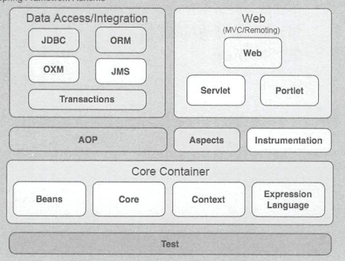

### spring5.0.X源码存在的问题
1. JDK版本问题，出现问题版本JDK8_11，目前版本JDK8_371
2. 镜像问题，改成国内阿里镜像
3. kotlin的dokka文档插件问题，注释即可
4. gradle版本问题，修改为4.4.1
5. idea设置问题，jre版本和jdk版本需要手动设置 Compiler配置JAVA1.8 和 kotlin jvm 1.8
6. kotlin编译版本问题，从1.1改为1.4

### Spring各模块分层

1. core container:核心容器包含有core beans context expression 等模块 其中core和beans是ioc和di的基础，基础框架为BeanFactory
    - core:包含核心工具类以供其他组件使用
    - beans:包含访问配置文件，创建和管理bean，操作ioc和di的类
    - context:在core和beans之上，提供了JNDI注册器对象访问，并为2个基础模块提供了大量扩展，比如国际化，事件传播，资源加载等。
    - expression:强大的表达式语言，属于jsp2.1规范的扩展，该语言支持属性的设置，方法的调用以及各种运算符。
2. data access/integration:数据访问和集成包括JDBC ORM OXM JMS TX 等模块
    - JDBC:提供抽象层消除编码，包含了Spring对JDBC数据访问的封装。
    - ORM:提供关系映射API，比如JPA JDO Hibernate Ibatis等
    - OXM:提供XML关系映射的抽象层，比如JAXB Castor XMLBeans JiBX XStream
    - JMS:包含了一些消息生产和消费的特性
    - TX:支持编程和申明式事物，这些事物类必须实现特定接口，且对所有POJO适用
3. WEB:建立在应用程序上下文模块之上，支持Struts框架的集成，还包含了Web-Servlet Web-Struts Web-Porlet模块
    - WEB:面向基础的WEB特性集成，比如 WEB应用上下文，多文件上传，初始化IOC容器
    - Web-Servlet:包含Spring的MVC
    - Web-Porlet:提供对Porlet环境的支持
    - Web-Struts:包含了对Struts框架的集成，3.0中被废弃
4. AOP:提供了符合AOP联盟标准的面向切面编程的实现
    - Aspects:提供了对Aspectj的支持
    - Instrumentation:提供了对class instrumentation和ClassLoader的实现，从而可以支持在特定的服务器上使用AOP
5. TEST:对Junit和TestNG的支持

