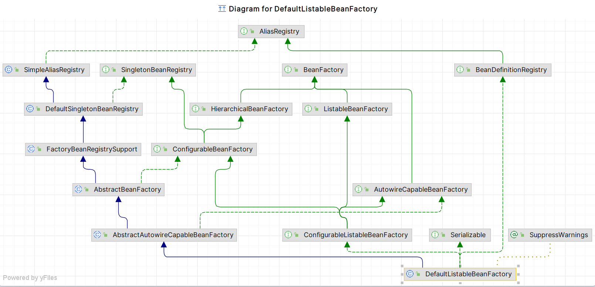

### Spring-beans模块的 bean核心加载类 DefaultListableBeanFactory
> 该类是整个bean加载的核心部分，是spring注册与加载bean的默认实现

#### 类与接口 
> 底层接口主要用通用类型 Object  泛型T  String[] 完成接口规范构建
1. AliasRegistry 接口:定义对Alias别名的基本的CRUD操作
2. SingletonBeanRegistry 接口:定义对单例bean的注册与获取
3. BeanFactory 接口:定义获取bean以及bean的类型判断
4. BeanDefinitionRegistry 接口:继承AliasRegistry,定义对BeanDefinition接口的CRUD操作(BeanDefinition是对bean属性的定义接口暂时不讨论)
5. HierarchicalBeanFactory 接口:继承BeanFactory,主要增加对parentFactory的支持
6. ListableBeanFactory 接口:继承BeanFactory,根据条件获取bean的配置清单,比如名称 类型 注解
7. AutowireCapableBeanFactory 接口:继承BeanFactory,提供创建bean，自动注入，初始化等，属于应用bean的后置处理器
8. ConfigurableBeanFactory 接口:继承HierarchicalBeanFactory, SingletonBeanRegistry,提供配置Factory的各种方法
9. ConfigurableListableBeanFactory 接口:继承ListableBeanFactory, AutowireCapableBeanFactory, ConfigurableBeanFactoryBeanFactory配置清单,分析和修改bean定义,指定忽略类型与接口
10. Serializable 接口:序列化接口，实现后可以将对象转换成字节流，实现网络通讯
11. SuppressWarnings 接口:忽略警告，因为没有指定序列化属性serialVersionUID会出现警告,可能源码觉得不需要通过跨JVM传输就没指定，但是是建议指定的。
12. SimpleAliasRegistry 类:实现AliasRegistry,CRUD接口进行实现，并使用map作为别名缓存
13. DefaultSingletonBeanRegistry 类:继承SimpleAliasRegistry,实现SingletonBeanRegistry接口的单例bean注册获取等,使用map作为单例bean缓存和工厂缓存
14. FactoryBeanRegistrySupport 抽象类:继承DefaultSingletonBeanRegistry,在DefaultSingletonBeanRegistry基础上增加了对FactoryBean的特殊处理
15. AbstractBeanFactory 抽象类:继承FactoryBeanRegistrySupport,实现ConfigurableBeanFactory接口,用于综合FactoryBeanRegistrySupport和ConfigurableBeanFactory的功能
16. AbstractAutowireCapableBeanFactory 抽象类:继承AbstractBeanFactory,实现AutowireCapableBeanFactory接口,
17. DefaultListableBeanFactory:默认的Spring的注册与加载

